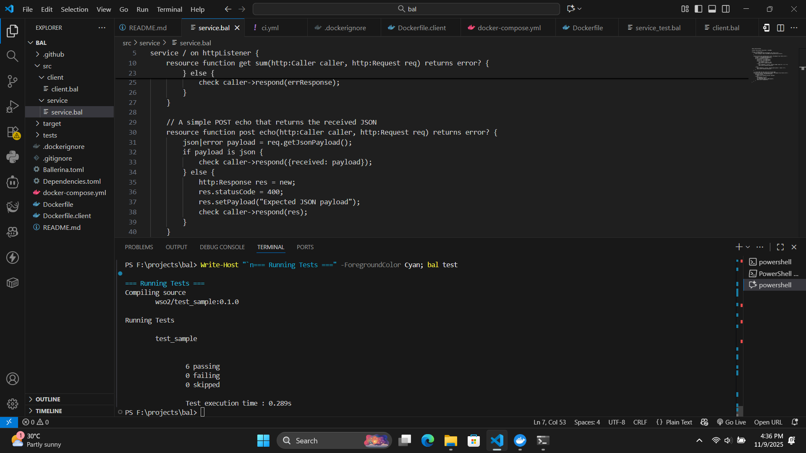

# WSO2-style Test Sample

A simple HTTP REST service built with Ballerina demonstrating best practices for building microservices - perfect for learning demos.

## 🎯 Purpose

This project demonstrates:
- **Building REST APIs** with Ballerina for enterprise integration (WSO2-style)
- **HTTP service patterns** - GET, POST endpoints with query params and JSON
- **Testing** - Automated unit tests for API validation
- **Containerization** - Docker deployment for cloud-ready applications
- **CI/CD** - GitHub Actions for automated build and test

**Use Cases:**
- Learning Ballerina for WSO2 integration projects
- Internship/demo project showing full development lifecycle
- Template for building microservices with tests and Docker support

## 📸 Screenshots

### Running the Client


### Testing the Service


### Test Results


## 🚀 Quick Start

```powershell
# Start the service
bal run src/service/service.bal

# Run the client (in another terminal)
bal run src/client/client.bal

# Run tests
bal test
```

## 📚 API Endpoints

| Endpoint | Method | Description | Example |
|----------|--------|-------------|---------|
| `/hello` | GET | Returns welcome message |
| `/sum?a=5&b=7` | GET | Adds two numbers |
| `/echo` | POST | Echoes JSON payload | `{"received": {...}}` |

### Test Manually

```powershell
# GET /hello
Invoke-RestMethod http://localhost:8080/hello | ConvertTo-Json

# GET /sum
Invoke-RestMethod 'http://localhost:8080/sum?a=10&b=20' | ConvertTo-Json

# POST /echo
$body = @{ name = 'User'; project = 'Demo' } | ConvertTo-Json
Invoke-RestMethod -Method POST -Uri http://localhost:8080/echo -Body $body -ContentType 'application/json' | ConvertTo-Json
```

## 🐳 Docker

```powershell
# Build and run
docker build -t wso2-ballerina-service .
docker run -d -p 8080:8080 wso2-ballerina-service

# Or use docker-compose
docker-compose up
```

## ✨ Features

- ✅ HTTP REST API with 3 endpoints
- ✅ 6 automated unit tests
- ✅ Docker & Docker Compose support
- ✅ GitHub Actions CI/CD
- ✅ Client demo application

---

**Built with [Ballerina](https://ballerina.io/)** 🦢
